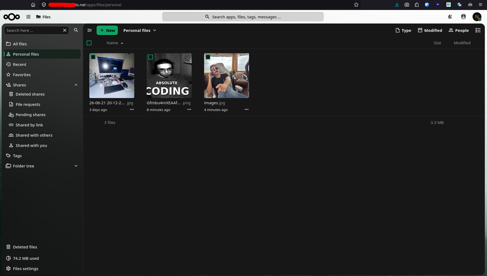
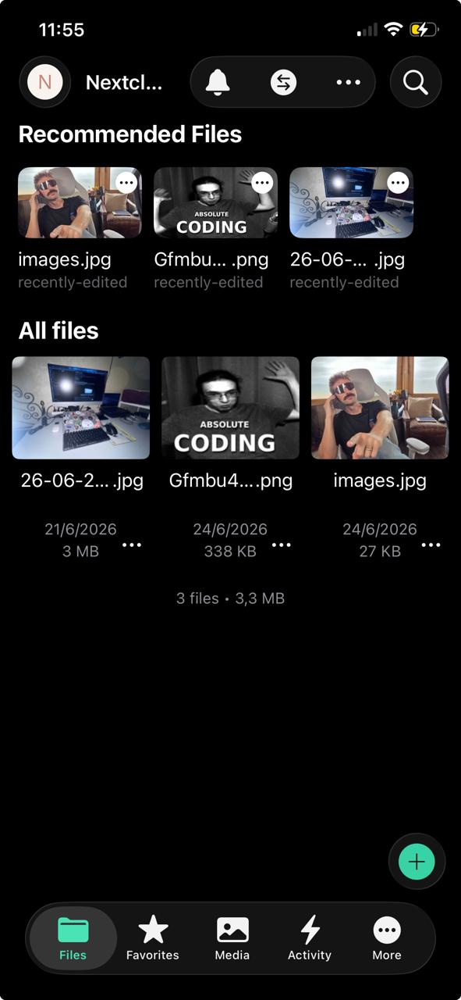
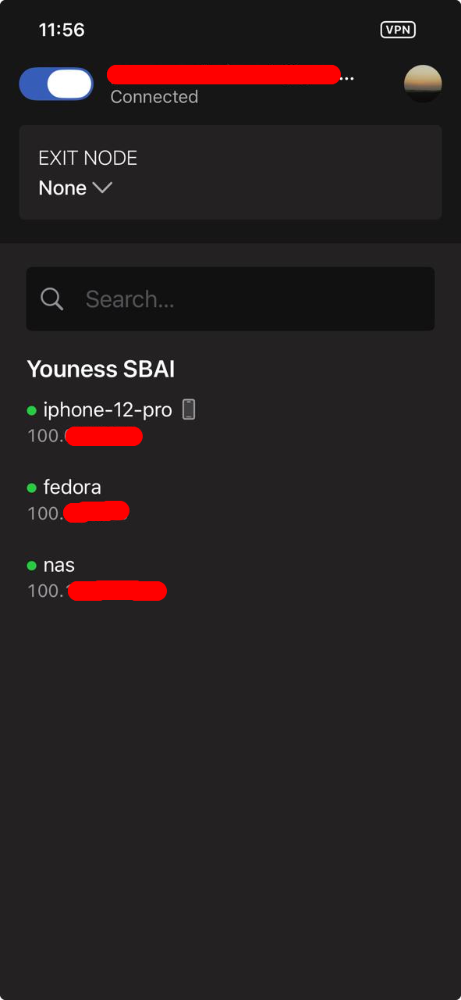
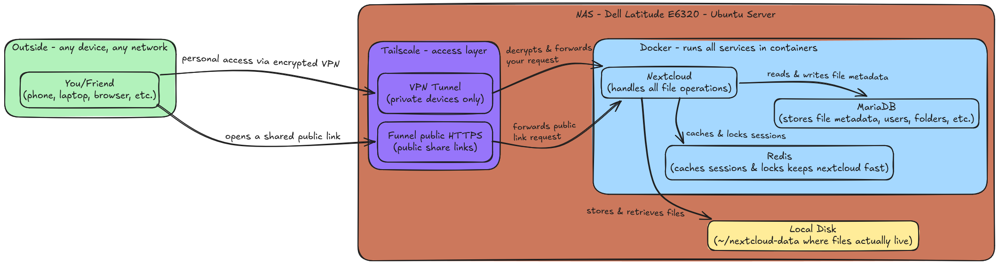
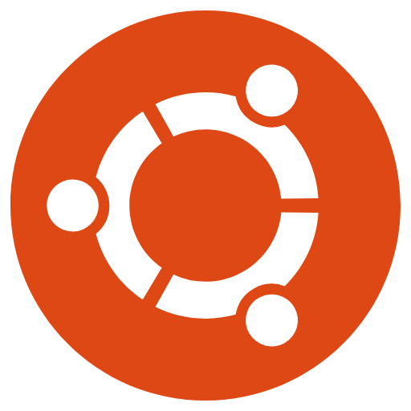
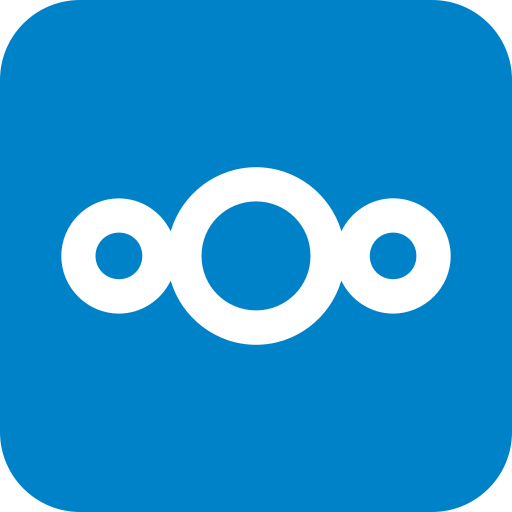
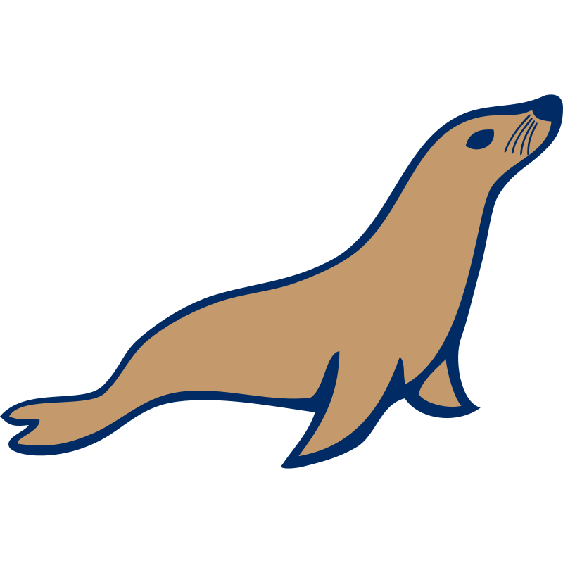
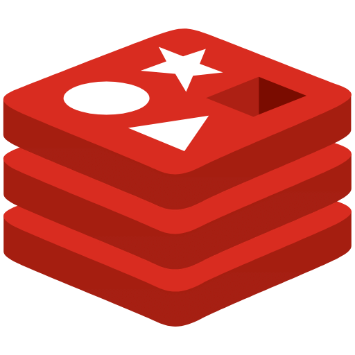
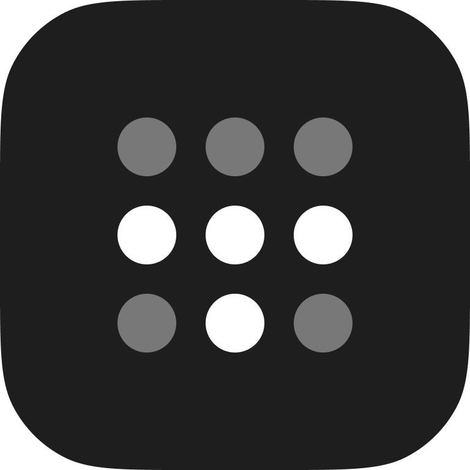

# Self-Hosted NAS: A Free Google Drive Replacement

A private cloud storage system built at home, using spare hardware, that handles file storage, photo backup, and secure sharing - with full CRUD access from anywhere in the world, and zero monthly fees.

<div align="center">
  
  <br/><br/><br/>
  
  &nbsp;&nbsp;&nbsp;&nbsp;&nbsp;&nbsp;
  
</div>

---

## Why I Built This

<p align="center">

</p>

My Google storage hit 14.83/15 GB. That's the free tier shared across everything - Drive, Gmail, Photos - and I'd maxed it out. Every time I wanted to upload something new, I had to go delete something old first, across three different apps, just to make 50 MB of room. For storage that was never really mine to begin with.

So instead of paying Google for more space, I dug out an old **Dell Latitude E6320** laptop that was sitting in a drawer and turned it into my own private cloud.

What I wanted out of it:
- **Storage that scales with my hardware, not a subscription tier**
- **Full ownership** of my documents and photos
- **No recurring fees**, ever
- **Remote access** from any device, anywhere
- **The ability to securely share files** with people who don't have any special software installed

This is the full walkthrough - what I installed, in what order, and why. Everything below is **free** and **open source**.

---

## Achitecture

<p align="center">

</p>

### How it Works

The Dell Latitude E6320 runs **Ubuntu Server** - that's the NAS. It's the physical machine and OS in one. Everything else runs on top of it.

**Tailscale** is installed directly on Ubuntu and acts as the access layer. When you open Nextcloud from your own phone or laptop, the request comes in through Tailscale's **VPN tunnel** - encrypted end-to-end, with no ports open on the router. When you share a file with someone who doesn't have Tailscale, **Funnel** takes over - it opens a single public HTTPS endpoint just for that link, while the rest of the server stays completely unreachable from the outside.

Once a request is through Tailscale, it lands at **Docker**, which runs three containers: **Nextcloud** is the main app - the Google Drive replacement users actually interact with. **MariaDB** is the database behind it, storing metadata for every file, folder, user, and share link. **Redis** caches sessions and handles file locking to keep Nextcloud responsive. When a file is uploaded or opened, Nextcloud reads and writes it directly to the **local disk** - a mounted folder on Ubuntu's internal drive, outside of Docker, so the data persists regardless of container restarts.

### Tech Stack

<table>
  <colgroup>
    <col style="width: 220px;">
    <col>
    <col>
  </colgroup>
  <tr>
    <th>Tool</th>
    <th>What it is</th>
    <th>Role in this project</th>
  </tr>
  <tr>
    <td> <b>Ubuntu Server</b></td>
    <td>Barebones Linux with no desktop, built for servers</td>
    <td>Host OS - the foundation everything else runs on</td>
  </tr>
  <tr>
    <td> <b>Docker</b></td>
    <td>Packages apps and their dependencies into isolated containers</td>
    <td>Runs Nextcloud, MariaDB, and Redis without any manual installation</td>
  </tr>
  <tr>
    <td> <b>Nextcloud</b></td>
    <td>Open-source, self-hosted alternative to Google Drive</td>
    <td>The main app - file storage, photo backup, sharing, CRUD</td>
  </tr>
  <tr>
    <td> <b>MariaDB</b></td>
    <td>A relational database (MySQL-compatible)</td>
    <td>Stores all of Nextcloud's metadata - files, users, folders, share links</td>
  </tr>
  <tr>
    <td> <b>Redis</b></td>
    <td>An in-memory cache</td>
    <td>Keeps Nextcloud fast - handles session caching and file locking</td>
  </tr>
  <tr>
    <td> <b>Tailscale</b></td>
    <td>A mesh VPN built on WireGuard, with a built-in feature called Funnel that can selectively expose services to the public internet</td>
    <td>VPN tunnel for my own devices - encrypted, no open ports. Funnel for everyone else - lets friends open shared links in any browser, no Tailscale needed</td>
  </tr>
</table>

---

## Setup & Configuration

### Step 1: Install Ubuntu Server

Download [Ubuntu Server LTS](https://ubuntu.com/download/server) and flash it to a USB stick. Use whatever tool you prefer:

- **[Balena Etcher](https://etcher.balena.io/)** - simple GUI, works on Windows, Mac, Linux
- **[Rufus](https://rufus.ie/)** - Windows only, more control over boot mode
- **Command line** (Linux/Mac) - fast, no extra tools needed:
```bash
sudo dd if=/path/to/ubuntu-server.iso of=/dev/sdX bs=4M status=progress && sync
```
> Replace `/dev/sdX` with your USB drive's device name - check with `lsblk` first.

Boot the target machine from the USB. During install:
- Enable **OpenSSH** - this lets you manage everything remotely from your main computer, no keyboard or monitor needed on the server
- Use the entire internal disk for storage
Once it reboots, find its local IP and SSH in from your main machine:
```bash
ssh username@192.168.X.X
```
> Both machines need to be on the same local network for this step - the `192.168.X.X` address is only reachable from inside your home network. Once Tailscale is set up in Step 4, you can SSH from anywhere using the Tailscale IP instead.

Every command from here runs over SSH.

Before anything else, update the system to make sure you're starting with the latest security patches:
```bash
sudo apt update && sudo apt upgrade -y
```


### Step 2: Install Docker

Instead of installing Nextcloud, MariaDB, and Redis directly on the system - which means managing dependencies, config files, and potential conflicts - Docker packages each one into its own isolated container. One command brings everything up, one command tears it down. Clean, reproducible, easy to update.

Install Docker and add your user to the Docker group so you don't need `sudo` every time:
```bash
curl -fsSL https://get.docker.com | sh
sudo usermod -aG docker $USER
```

Log out and back in for the group change to apply, then verify Docker is working:
```bash
docker run hello-world
```
If it prints a success message, you're good to move on.


### Step 3: Deploy Nextcloud

This step brings three services up together: **Nextcloud** is the app you interact with, **MariaDB** is the database that stores all file metadata, and **Redis** is the cache that keeps things fast. You only ever see Nextcloud - the other two run quietly behind it. Docker Compose defines all three in one file and starts them with a single command.

Create a folder for the project and open the config file:
```bash
mkdir ~/nextcloud && cd ~/nextcloud
nano docker-compose.yml
```

Paste in this configuration:

```yaml
version: '3.8'
services:
  db:
    image: mariadb:10.11
    container_name: nextcloud-db
    restart: always
    environment:
      MYSQL_ROOT_PASSWORD: change_this_root_password
      MYSQL_DATABASE: nextcloud
      MYSQL_USER: nextcloud
      MYSQL_PASSWORD: change_this_db_password
    volumes:
      - db_data:/var/lib/mysql
  redis:
    image: redis:alpine
    container_name: nextcloud-redis
    restart: always
  app:
    image: nextcloud:latest
    container_name: nextcloud-app
    restart: always
    ports:
      - "8080:80"
    depends_on:
      - db
      - redis
    environment:
      MYSQL_HOST: db
      MYSQL_DATABASE: nextcloud
      MYSQL_USER: nextcloud
      MYSQL_PASSWORD: change_this_db_password
      REDIS_HOST: redis
      NEXTCLOUD_TRUSTED_DOMAINS: "localhost 192.168.X.X"  # replace with your server IP
    volumes:
      - nextcloud_core:/var/www/html
      - ~/nextcloud-data:/var/www/html/data  # your files go here
volumes:
  db_data:
  nextcloud_core:
```

> **Important:** Replace both `change_this_*` passwords with strong passwords of your own, and replace `192.168.X.X` with your server's actual local IP address.

Save the file (`Ctrl+O`, Enter, `Ctrl+X`), then start everything:
```bash
docker compose up -d
```

Docker will pull all three images and start the containers - this takes 2–5 minutes the first time depending on your internet connection. The `-d` flag runs everything in the background so it keeps going even after you close the terminal.

**Check everything is running:**
```bash
docker compose ps
```
All three containers - `nextcloud-db`, `nextcloud-redis`, and `nextcloud-app` - should show `Up`.

**Open Nextcloud in your browser.** On any device on the same home network, go to:
```
http://192.168.X.X:8080
```

You'll see the Nextcloud setup screen. Create your admin account - choose a strong username and password, this is your main login. Under **Storage & database**, select **MySQL/MariaDB** and fill in:

- Database user: `nextcloud`
- Database password: whatever you set for `change_this_db_password`
- Database name: `nextcloud`
- Database host: `db`

Click **Finish Setup**. It takes about a minute. You now have a fully working private cloud running on your own hardware.


### Step 4: Configure Remote Access with Tailscale

Tailscale creates an encrypted tunnel between your devices and the server - no port forwarding, no exposed router, no static IP needed. Every device on your Tailscale account gets a permanent private IP that works from anywhere in the world.

**Install Tailscale on your server:**
```bash
curl -fsSL https://tailscale.com/install.sh | sh
sudo tailscale up
```

It will print a URL - open it in your browser to authenticate. Sign up for a free account if you don't have one yet.

**Enable MagicDNS and HTTPS certificates** in the [Tailscale admin console](https://login.tailscale.com/admin/dns). MagicDNS gives your server a stable hostname like `nas.your-tailnet.ts.net` instead of a raw IP. HTTPS certificates give you a valid padlock in the browser for free.

**Get your server's Tailscale hostname:**
Your hostname is visible in the [Tailscale admin console](https://login.tailscale.com/admin/machines) under your server's entry. You can also get it from the command line:
```bash
tailscale dns status
```
Look for this line in the output:
```
Other devices in your tailnet can reach this device at nas.your-tailnet.ts.net.
```
Use that hostname in all the steps below.

**Tell Tailscale to serve Nextcloud over HTTPS:**
```bash
sudo tailscale serve --bg http://localhost:8080
```
This tells Tailscale to accept HTTPS traffic on port 443 and forward it to Nextcloud on port 8080 locally.

**Tell Nextcloud to trust its new Tailscale domain:**
```bash
docker exec --user www-data nextcloud-app php occ config:system:set trusted_domains 1 --value="nas.your-tailnet.ts.net"
docker exec --user www-data nextcloud-app php occ config:system:set overwriteprotocol --value="https"
docker exec --user www-data nextcloud-app php occ config:system:set overwritehost --value="nas.your-tailnet.ts.net"
```
> Replace `nas.your-tailnet.ts.net` with your actual Tailscale hostname from the step above.

**Install Tailscale on your other devices** and log in with the same account:

- **iPhone / Android** - install the Tailscale app from the App Store or Play Store
- **Windows** - download from [tailscale.com/download](https://tailscale.com/download)
- **macOS** - download from the Mac App Store or [tailscale.com/download](https://tailscale.com/download)
- **Linux** - run the same install script:
```bash
curl -fsSL https://tailscale.com/install.sh | sh
sudo tailscale up
```

Once logged in on any device, open your Nextcloud at:
```
https://nas.your-tailnet.ts.net
```
Real HTTPS padlock, fully encrypted, works from your home network or anywhere in the world.

**Set up the mobile app for automatic photo backup:**

1. Install the **Nextcloud** app (iOS or Android)
2. Open it → tap **Log in**
3. Server address: `https://nas.your-tailnet.ts.net`
4. Enter your admin username and password
5. Go to **Settings → Auto Upload** → enable it for your Camera folder
Your photos will now back up automatically to your NAS whenever Tailscale is connected - stored on your own drive, never on someone else's server.


### Step 5: Enable Public File Sharing with Funnel

Enable Funnel to make shared links accessible to anyone, even without Tailscale:
```bash
sudo tailscale funnel --bg http://localhost:8080
```

Then in Nextcloud, right-click any file → **Share** → **Create public link**, optionally set a password and an expiration date, and send the link. The recipient opens it in any browser - no account, no app, no VPN required.

---

## The Reality of Security

Here's the thing nobody likes to say out loud: **your data's security is never entirely in your own hands, even when you self-host.**

Self-hosting removes one specific risk - a company scanning your files, training models on them, or losing them in a breach you have no control over. That's real, and it's worth something. But it trades that risk for a different set of responsibilities that are now entirely on you:

- **You are now your own sysadmin.** If Nextcloud has a vulnerability and you don't patch it, that's on you - there's no security team behind you.
- **Tailscale Funnel makes your login page public.** I mitigate that with 2FA, password-protected links, and link expiration, but "mitigate" isn't "eliminate." A misconfigured share or a weak password is now my mistake to make, not a faceless company's.
- **Hardware fails.** A laptop hard drive can die with zero warning. Google Drive has redundancy across data centers; my old Dell Latitude has exactly one disk. If I don't back this up somewhere else too, "owning my data" can turn into "losing my data" in one bad afternoon.
- **Your home internet becomes infrastructure.** Power outages, ISP downtime, a router reboot at the wrong time - all now my problem, not a 24/7 ops team's.

So this isn't "self-hosting is more secure than the cloud." It's "self-hosting moves the responsibility for security from a company to me, and I'd rather hold that responsibility myself than hand it over - as long as I take it seriously." If you do this too, actually do the hardening steps. Don't just stand up Nextcloud and Funnel and call it done.

### What I actually did about it

- Enabled two-factor authentication on the admin account
- Every public share link gets a password and an expiration date
- Renamed the admin account away from anything guessable
- Started a second backup - a periodic copy of `~/nextcloud-data` to a separate drive, because RAID and Docker volumes are not a backup plan

---

## What I ended up with

- A private cloud for documents and photos, fully equivalent to Google Storage day-to-day
- Real create/read/update/delete access from any device, anywhere
- Automatic photo backup from my phone through the Nextcloud app
- A way to send files to non-technical people that just works - they click a link
- HTTPS everywhere, no open ports on my router, no monthly bill
- My data stays on hardware I own, except for the specific moments I choose to share it

---

## Should you build this too?

If you've ever hit a storage ceiling, paid for more cloud space than you wanted to, or just didn't love the idea of your personal files sitting on someone else's server - yes, probably. The hardware cost is whatever's already sitting in a drawer: an old laptop, a Raspberry Pi, anything with a disk and a network port. After that it's free, it's yours, and you can keep building on it - photos, contacts, calendars, dozens of other self-hosted apps in the same ecosystem.

Just go in with eyes open about what you're signing up for. You're not eliminating risk, you're taking it on yourself. For me, that trade was worth it. It might be for you too.
