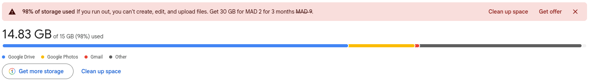

# Self-Hosted NAS: A Free Google Drive Replacement

A private cloud storage system built at home, using spare hardware, that handles file storage, photo backup, and secure sharing - with full CRUD access from anywhere in the world, and zero monthly fees.

---

## Why I Built This

My Google storage hit 14.83/15 GB. That's the free tier shared across everything - Drive, Gmail, Photos - and I'd maxed it out. Every time I wanted to upload something new, I had to go delete something old first, across three different apps, just to make 50 MB of room. For storage that was never really mine to begin with.

So instead of paying Google for more space, I dug out an old **Dell Latitude E6320** laptop that was sitting in a drawer and turned it into my own private cloud.

What I wanted out of it:
- **Storage that scales with my hardware, not a subscription tier**
- **Full ownership** of my documents and photos
- **No recurring fees**, ever
- **Remote access** from any device, anywhere
- **The ability to securely share files** with people who don't have any special software installed

This is the full walkthrough - what I installed, in what order, and why. Everything below is **free** and **open source**.
